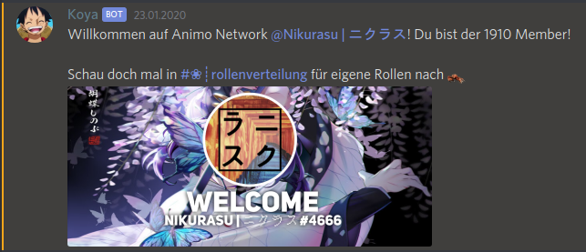
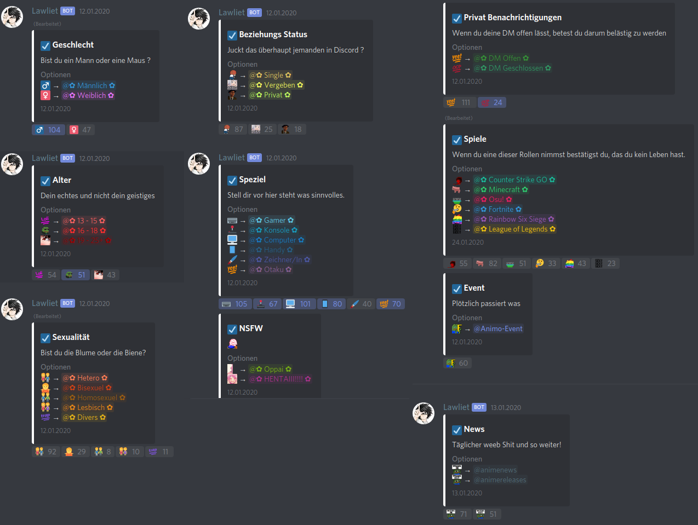

Damit du dich auf unserem Server zurechtfindest seht auf dieser Seite alles wichtige, z.B. die Regeln und wie die Bots. <b>Wenn etwas fehlt schreibst du einfach ein Mitglied des Serverteams an.</b> Wer das ist steht auf <a href="#"> dieser Seite</a>. In diesem Fall werden wir diese Info so schnell wie m&ouml;glich hier erg&auml;nzen.
<h2 class="tableOfContents">Regeln</h2>
<ol>
    <li>Bitte beachte, dass jeder Channel seinen eigenen Nutzen hat.</li>
    <li>Reife Gespräche und gegenseitiger Respekt sind vorausgesetzt. Hassreden und Beleidigungen jeglicher Art werden nicht toleriert.</li>
    <li>Spam und aggressives Verhalten werden nicht geduldet.</li>
    <li>Werbung jeglicher Art ist verboten. Begrenzte Ausnahmen gelten mit deutlicher Erlaubnis eines Führungsmitgliedes.</li>
    <li>Handel untereinander ist auf diesem Server streng verboten.</li>
</ol>
<h2 class="table of contents">Kanal-&Uuml;bersicht</h2>
Hier mal eine &Uuml;bersicht &uuml;ber die Kan&auml;le auf dem Server.

&Uuml;ber uns<i class="fa fa-chevron-down" aria-hidden="true"></i>

    
<i class="fa fa-hashtag" aria-hidden="true"></i>Hall of Fame

    
<i class="fa fa-hashtag" aria-hidden="true"></i>Serverteam

    
<i class="fa fa-hashtag" aria-hidden="true"></i>Invite-System

    
<i class="fa fa-hashtag" aria-hidden="true"></i>Serverrollen

    
<i class="fa fa-hashtag" aria-hidden="true"></i>Server-Boot

    
<i class="fa fa-hashtag" aria-hidden="true"></i>Partner

Server Information<i class="fa fa-chevron-down" aria-hidden="true"></i>

    
<i class="fa fa-hashtag" aria-hidden="true"></i>Regeln

    
<i class="fa fa-hashtag" aria-hidden="true"></i>Rollenverteilung

    
<i class="fa fa-hashtag" aria-hidden="true"></i>Info

    
<i class="fa fa-hashtag" aria-hidden="true"></i>Animo Events

LOL Turnier<i class="fa fa-chevron-down" aria-hidden="true"></i>

    
<i class="fa fa-hashtag" aria-hidden="true"></i>Matches

    
<i class="fa fa-hashtag" aria-hidden="true"></i>animagic-2020

Main  Chats<i class="fa fa-chevron-down" aria-hidden="true"></i>

    
<i class="fa fa-hashtag" aria-hidden="true"></i>Main Chat

    
<i class="fa fa-hashtag" aria-hidden="true"></i>Anime Talk

    
<i class="fa fa-hashtag" aria-hidden="true"></i>Meme Channel

    
<i class="fa fa-hashtag" aria-hidden="true"></i>Vorsch&auml;ge

    
<i class="fa fa-hashtag" aria-hidden="true"></i>Vorstellungen
    

Weebs|Media<i class="fa fa-chevron-down" aria-hidden="true"></i>

    
<i class="fa fa-hashtag" aria-hidden="true"></i>Art

    
<i class="fa fa-hashtag" aria-hidden="true"></i>Selfie

    
<i class="fa fa-hashtag" aria-hidden="true"></i>Bilder Videos

    
<i class="fa fa-hashtag" aria-hidden="true"></i>Musik

    
<i class="fa fa-hashtag" aria-hidden="true"></i>YouTube Promo

Bots/Arcade<i class="fa fa-chevron-down" aria-hidden="true"></i>

    
<i class="fa fa-hashtag" aria-hidden="true"></i>Spiele Info

    
<i class="fa fa-hashtag" aria-hidden="true"></i>Bot-Commands

    
<i class="fa fa-hashtag" aria-hidden="true"></i>Blackjack

    
<i class="fa fa-hashtag" aria-hidden="true"></i>Mudamaid Bot

    
<i class="fa fa-hashtag" aria-hidden="true"></i>Pokemon Bot

    
<i class="fa fa-hashtag" aria-hidden="true"></i>Zahlenspiel

    
<i class="fa fa-hashtag" aria-hidden="true"></i>Sonstiges

Feedback & Bump<i class="fa fa-chevron-down" aria-hidden="true"></i>

    
<i class="fa fa-hashtag" aria-hidden="true"></i>Bump

    
<i class="fa fa-hashtag" aria-hidden="true"></i>Feedback

Sprachkan&auml;le<i class="fa fa-chevron-down" aria-hidden="true"></i>

    
<i class="fa fa-hashtag" aria-hidden="true"></i>Voice Commands

    
<i class="fa fa-volume-up" aria-hidden="true"></i>Ask 4 move

    
<i class="fa fa-volume-up" aria-hidden="true"></i>Gruppentalk

    
<i class="fa fa-volume-up" aria-hidden="true"></i>Musiklounge

    
<i class="fa fa-volume-up" aria-hidden="true"></i>Eigen Kanal

    
<i class="fa fa-volume-up" aria-hidden="true"></i>Nicht Anwesend

Server Support<i class="fa fa-chevron-down" aria-hidden="true"></i>

    
<i class="fa fa-hashtag" aria-hidden="true"></i>Hilfe

    
<i class="fa fa-volume-up" aria-hidden="true"></i>Warten f&uuml;r Support

    
<i class="fa fa-volume-up" aria-hidden="true"></i>Support .1

    
<i class="fa fa-volume-up" aria-hidden="true"></i>Support .2

<h2 class="tableOfContents" style="margin-top: 50px;">Kleines Einstiegstutorial</h2>

So, dieser Abschnitt soll als kleine Hilfe dienen, die alles zeigt, was man machen kann, sobald man dem Server beigetreten ist. 
Wie auch auf vielen anderen Servern schickt euch ein Bot, bei uns der Koya-Bot, eine Willkommensnachricht.
 
Wie auch in der Nachricht steht, gibt es in unserem Server in dem Kanal Rollenverteilung verschiedene Rollen, die man sich selbst durch einfaches Reagieren auf Nachrichten selbst geben kann. Hier ist von Alter bis zum Entscheiden, ob man Privatnachrichten von anderen Servermitgliedern erhalten will alles dabei, wenn ihr jedoch trotzdem noch Vorschl&auml;ge habt, schickt die einfach in den Vorsch&auml;ge Kanal.
 
Desweiteren hat der Server natürlich noch ein Level-System. Wenn ihr euer momentanes Level